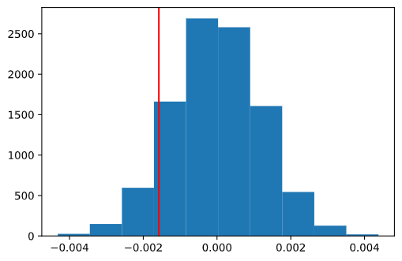

# AB Testing
Analyze AB Test Results

## Introduction ##
-----
A/B tests are very commonly performed by data analysts and data scientists. 

This project, Will help in understand the results of an A/B test run by an e-commerce website. The goal of this notebook is to help the company understand if they should implement the new page, keep the old page, or perhaps run the experiment longer to make their decision.

## Language and Packages 
-----
[Python](https://www.python.org/)
 
[statsmodel](https://www.statsmodels.org/stable/index.html)

## Key techniques used 
-----
- Sampling Distributions
- Bootstrapping
- Hypothesis testing
- Logistic regression

## Conclusions 
----
This project was to help the company understand if they should implement this new page, keep the old page, or may be run the experiment longer to make their decision.

I started with - Part II: by setting up a one sided hypothesis - by setting the old page is better unless the new page proves to be definitely better. This study concluded that with a p-value of 0.904, we could not reject the null hypothesis. I also calculated the z-value which also failed to reject the null hypothesis.

**Sampling Distribution Histogram**

**One Tailed Test Histogram**

Continuing with Part III: I used the logistic regression model to calculate the p-value. I also introduced another factor into the regression model, the country in which a user lives. This was to avoid Simpson's Paradox and make sure there was consistency among test subjects in the control and experiment group. There was no indication that the user's country of residence significantly effected their conversion rate.

I therefore conclude that there is no practical reason to adopt the new page as there is no evidence that the new page raises the conversion rates for users and therefore, it is not advisable to launch the new page.

